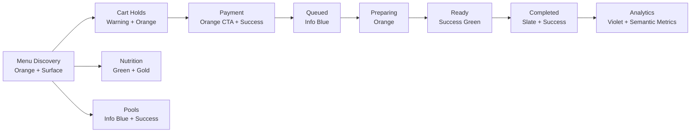
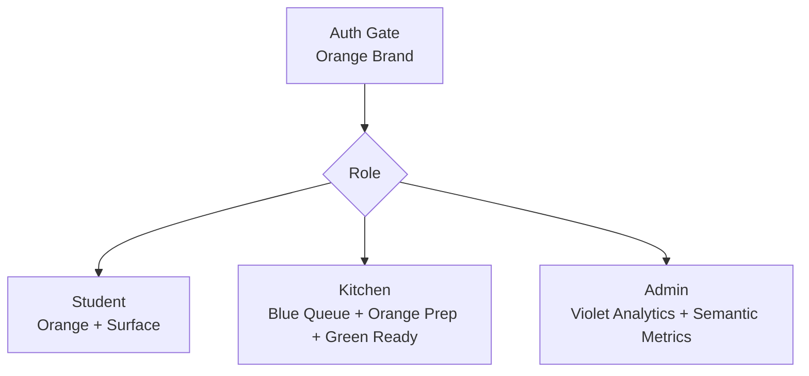

# UniFeast App Color Flow

This file documents the color system currently used across UniFeast.

Primary source files:

- `client/src/index.css`
- `client/src/pages/KitchenDashboard/kitchenColors.js`
- `README.md` Mermaid diagrams and product identity notes

The app uses a dark operations-console base, warm orange action color, green live/success states, blue queue/info states, red danger states, and violet admin/analytics accents.

---

## 1. Core Brand Palette

### Primary Orange

Used for UniFeast identity, checkout actions, active CTAs, menu highlights, progress accents, and urgent kitchen actions.

| Token | Hex | Usage |
|---|---|---|
| `--color-primary-50` | `#fff5f2` | Very light orange tint |
| `--color-primary-100` | `#ffe8df` | Light backgrounds |
| `--color-primary-200` | `#ffc9b8` | Soft highlights |
| `--color-primary-300` | `#ffa187` | Badge text and soft text |
| `--color-primary-400` | `#ff6a42` | Main text accent |
| `--color-primary-500` | `#ff4714` | Main brand/action color |
| `--color-primary-600` | `#e52800` | Strong action hover |
| `--color-primary-700` | `#b91d00` | Deep action shade |
| `--color-primary-800` | `#931904` | Dark orange surface mix |
| `--color-primary-900` | `#781807` | Deep background accent |
| `--color-primary-950` | `#420800` | Darkest orange shadow/base |

### Accent Gold

Used for rewards, XP, badges, rank highlights, and premium/achievement signals.

| Token | Hex | Usage |
|---|---|---|
| `--color-accent-500` | `#ffd700` | Gold highlight |
| `--color-accent-600` | `#e6c200` | Gold hover/deep shade |

---

## 2. Surface Palette

The app is mostly built on slate/obsidian surfaces.

| Token | Hex | Usage |
|---|---|---|
| `--color-surface-50` | `#fafafa` | Brightest text in dark theme |
| `--color-surface-100` | `#f4f4f5` | Primary text |
| `--color-surface-200` | `#e4e4e7` | Secondary strong text |
| `--color-surface-300` | `#d4d4d8` | Labels and muted headings |
| `--color-surface-400` | `#a1a1aa` | Muted body text |
| `--color-surface-500` | `#71717a` | Disabled/subtle text |
| `--color-surface-600` | `#52525b` | Medium borders |
| `--color-surface-700` | `#3f3f46` | Strong borders and controls |
| `--color-surface-800` | `#27272a` | Card controls and panels |
| `--color-surface-900` | `#18181b` | Solid panels |
| `--color-surface-950` | `#09090b` | App background |

---

## 3. Semantic Palette

| Token | Hex | Meaning |
|---|---|---|
| `--color-success` | `#10b981` | Live, available, completed, healthy progress |
| `--color-warning` | `#f59e0b` | Pending, caution, waiting |
| `--color-danger` | `#ef4444` | Error, delete, cancelled, destructive action |
| `--color-info` | `#3b82f6` | Queue, pooled/linked info, neutral system state |

---

## 4. Theme Variables

### Dark Theme

| Token | Value | Usage |
|---|---|---|
| `--app-bg` | `var(--color-surface-950)` | Page background |
| `--app-text` | `var(--color-surface-100)` | Main readable text |
| `--app-muted` | `var(--color-surface-400)` | Helper text |
| `--app-muted-strong` | `var(--color-surface-500)` | Secondary muted text |
| `--app-panel` | `rgba(24, 24, 27, 0.55)` | Glass panels |
| `--app-panel-strong` | `rgba(24, 24, 27, 0.78)` | Strong cards |
| `--app-panel-solid` | `var(--color-surface-900)` | Solid cards |
| `--app-input` | `rgba(24, 24, 27, 0.6)` | Inputs |
| `--app-input-strong` | `rgba(24, 24, 27, 0.8)` | Strong input backgrounds |
| `--app-nav` | `rgba(9, 9, 11, 0.86)` | App navigation |
| `--app-public-nav` | `rgba(9, 9, 11, 0.88)` | Public navigation |
| `--app-border` | `rgba(255, 255, 255, 0.08)` | Default border |
| `--app-border-soft` | `rgba(255, 255, 255, 0.05)` | Soft border |
| `--app-border-strong` | `rgba(255, 255, 255, 0.12)` | Strong border |
| `--app-hover` | `rgba(255, 255, 255, 0.05)` | Hover surfaces |

### Light Theme

| Token | Value | Usage |
|---|---|---|
| `--app-bg` | `#f2ede4` | Warm light page background |
| `--app-text` | `#201e1b` | Main readable text |
| `--app-muted` | `#746d64` | Helper text |
| `--app-muted-strong` | `#8a8177` | Secondary muted text |
| `--app-panel` | `rgba(255, 252, 247, 0.78)` | Light glass panels |
| `--app-panel-strong` | `rgba(255, 252, 247, 0.9)` | Strong light cards |
| `--app-panel-solid` | `#fffbf5` | Solid light panels |
| `--app-input` | `rgba(255, 252, 247, 0.78)` | Light inputs |
| `--app-nav` | `rgba(250, 246, 239, 0.9)` | Light app navigation |
| `--app-border` | `rgba(52, 45, 38, 0.12)` | Default light border |
| `--app-hover` | `rgba(92, 70, 55, 0.07)` | Light hover surfaces |

---

## 5. Product Flow Colors

| Flow | Main Colors | Purpose |
|---|---|---|
| Student ordering | Orange, dark surface, green | Browse, add, pay, track, ready feedback |
| Cart and checkout | Orange, green, warning | Holds, payment, reservation, checkout action |
| Kitchen operations | Blue, orange, green, red | Queue, preparing, ready, cancelled |
| Admin analytics | Violet accents, orange, green, red | Control room, metrics, cohorts, revenue |
| Nutrition | Green, gold, orange | Health progress, XP, badges, analysis |
| Outside food pools | Blue, green, orange | Pool discovery, joined state, owner action |
| Errors/destructive actions | Red | Delete, failed, cancelled, invalid state |

---

## 6. Kitchen Status Colors

Defined in `client/src/pages/KitchenDashboard/kitchenColors.js`.

| Status | Background | Border | Text | Badge | Meaning |
|---|---|---|---|---|---|
| `PENDING` | `#171717` | `#9CA3AF` | `#E4E4E7` | `#6B7280` | Created but not in active kitchen flow |
| `QUEUED` | `#111827` | `#3B82F6` | `#DBEAFE` | `#2563EB` | Waiting in kitchen queue |
| `PREPARING` | `#1E1B16` | `#F97316` | `#FFEDD5` | `#EA580C` | Being prepared |
| `READY` | `#052E1A` | `#22C55E` | `#DCFCE7` | `#16A34A` | Ready for pickup |
| `COMPLETED` | `#0F172A` | `#64748B` | `#CBD5E1` | `#475569` | Pickup complete |
| `CANCELLED` | `#2A0B0B` | `#DC2626` | `#FECACA` | `#DC2626` | Cancelled |

Urgency shadows:

| Level | Value | Usage |
|---|---|---|
| Normal | `none` | Healthy ETA |
| Warning | `0 0 0 2px rgba(249,115,22,0.55)` | ETA nearing limit |
| Critical | `0 0 0 3px rgba(220,38,38,0.7)` | ETA breached |

---

## 7. Badge Colors

Defined in `client/src/index.css`.

| Class | Background | Text | Border | Usage |
|---|---|---|---|---|
| `.badge-success` | `rgba(16, 185, 129, 0.15)` | `#34d399` | `rgba(16, 185, 129, 0.3)` | Live, completed, joined |
| `.badge-warning` | `rgba(245, 158, 11, 0.15)` | `#fbbf24` | `rgba(245, 158, 11, 0.3)` | Pending, waiting |
| `.badge-primary` | `rgba(255, 71, 20, 0.15)` | `--color-primary-300` | `rgba(255, 71, 20, 0.3)` | Primary highlights |
| `.badge-info` | `rgba(59, 130, 246, 0.15)` | `#60a5fa` | `rgba(59, 130, 246, 0.3)` | Queue, pooled, info |
| `.badge-danger` | `rgba(239, 68, 68, 0.15)` | `#f87171` | `rgba(239, 68, 68, 0.3)` | Cancelled, delete, unavailable |

---

## 8. Role Color Mapping

| Role | Color Identity | Used In |
|---|---|---|
| Student | Orange + dark glass | Menu, cart, orders, checkout |
| Kitchen | Green + orange + blue status colors | Live orders, queue, QR scanner, stock |
| Admin | Violet + orange + semantic metrics | Dashboard, analytics, user management |
| Public pages | Orange + dark glass | Landing, public nav, onboarding |

---

## 9. Component Usage Rules

Use these rules when adding new UI:

| Component | Preferred Color |
|---|---|
| Primary action button | `--color-primary-500` |
| Primary action hover | `--color-primary-600` or `--color-primary-400` |
| Success action | `--color-success` |
| Delete/destructive action | `--color-danger` |
| Informational state | `--color-info` |
| Warning state | `--color-warning` |
| Page background | `--app-bg` |
| Card background | `--app-panel`, `--app-panel-strong`, or `--app-panel-solid` |
| Text | `--app-text` |
| Helper text | `--app-muted` |
| Borders | `--app-border` or `--app-border-strong` |
| Input background | `--app-input` |

Avoid one-off hex colors unless the value is part of a defined status palette, chart palette, or asset-specific gradient.

---

## 10. Quick Reference

| Need | Use |
|---|---|
| Brand highlight | `text-primary-400` or `--color-primary-500` |
| Strong CTA | `btn-primary` |
| Card | `glass-card-static` or `--app-panel` |
| Live/available state | `--color-success` or `.badge-success` |
| Queue/info state | `--color-info` or `.badge-info` |
| Preparing/in-progress state | `--color-primary-500` or `.badge-primary` |
| Pending/caution state | `--color-warning` or `.badge-warning` |
| Cancel/delete/error | `--color-danger` or `.badge-danger` |
| Achievement/reward | `--color-accent-500` |

