# UniFeast

UniFeast is a campus-first dining platform for IIIT Nagpur. It brings menu discovery, cart reservations, paid orders, live kitchen operations, queue visibility, pooled outside-food coordination, nutrition tracking, and admin analytics into one connected system.

This README is written as private project documentation. It explains the product flow, architecture, data movement, and key functionality. It intentionally does not include local setup or deployment instructions.

## Product Snapshot

| Area | What UniFeast Handles |
| --- | --- |
| Student ordering | Browse fixed canteen menu, reserve limited stock, pay, track order status, view QR pickup proof, and see personal order history. |
| Kitchen operations | Manage menu items, daily stock, production quantity, live orders, queue timing, QR scanning, and order status movement. |
| Admin control | Manage users, roles, restaurants, canteen status, cart hold timing, and analytics across spend, orders, cohorts, and items. |
| Outside-food pools | Students create or join shared pools, request locked-pool access, chat in pool rooms, and coordinate group ordering. |
| Nutrition | Students log meals, analyze food images, set goals, track daily/weekly/monthly nutrition, and compete on a badge-based leaderboard. |
| Realtime updates | Socket.IO pushes order, queue, stock, kitchen, ETA, and pool updates without waiting for manual refresh. |

## System Overview

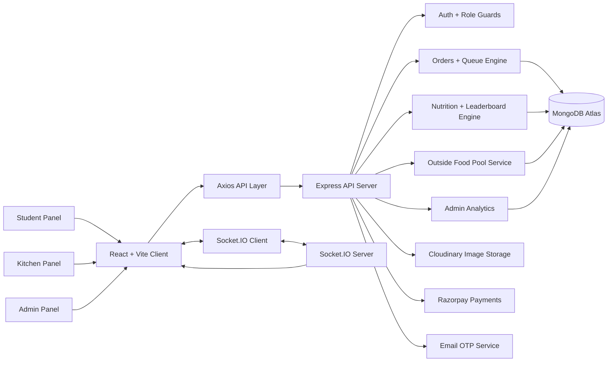

## Role Based Experience

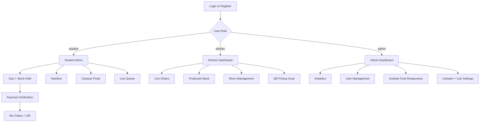

## Core User Flows

### 1. Student Canteen Order Flow

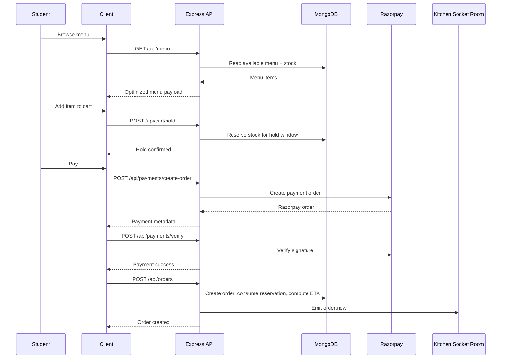

### 2. Kitchen Fulfillment Flow

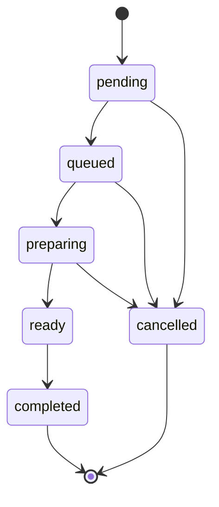

Kitchen users work from a live dashboard. New orders enter the kitchen room through Socket.IO, queue summaries update in real time, and produced-stock allocation can automatically mark orders ready when every requested item is covered.

Pickup verification is QR-based:

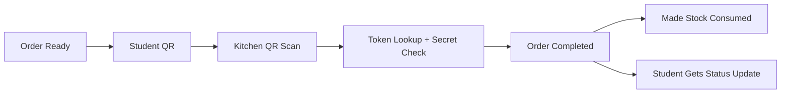

### 3. Nutrition and Ranking Flow

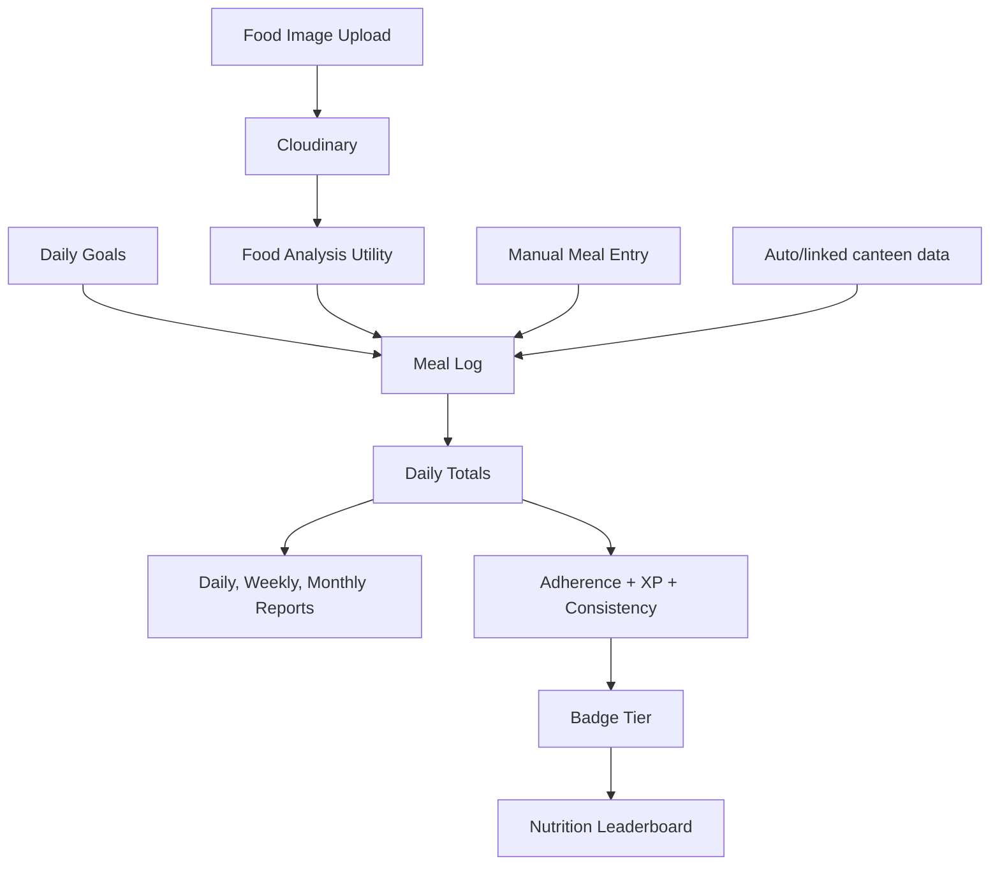

Nutrition ranking uses three main ideas:

| Term | Meaning |
| --- | --- |
| Consistency | A day counts only when meal data exists and daily adherence is at least 50 percent. |
| XP | Activity points from logging meals, meaningful logs, adherence quality, protein, fiber, and calorie accuracy. |
| Adherence | How close daily totals are to calorie, protein, fiber, carb, and fat goals. |

Badge progression requires all three requirements at each tier: consistent days, total XP, and average adherence.

| Badge | Days | XP | Average Adherence |
| --- | ---: | ---: | ---: |
| Begin | 0 | 0 | 0 percent |
| Build | 14 | 1,000 | 60 percent |
| Balance | 28 | 2,500 | 65 percent |
| Steady | 50 | 5,000 | 70 percent |
| Aligned | 100 | 12,000 | 75 percent |
| Sustain | 200 | 28,000 | 80 percent |
| Thrive | 365 | 60,000 | 85 percent |

Leaderboard order:

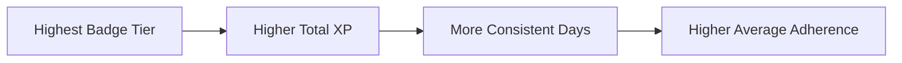

### 4. Outside Food Pooling Flow

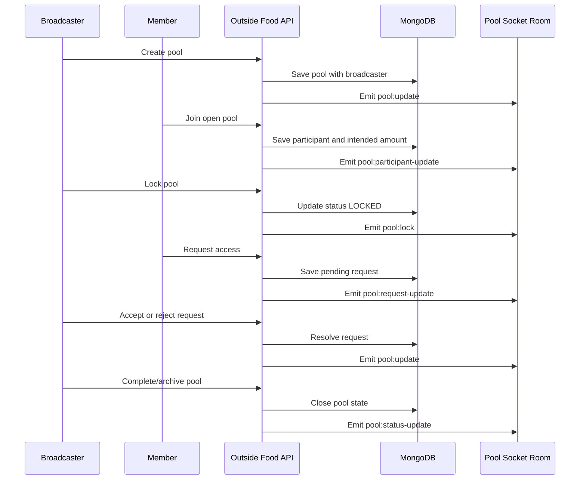

The pool creator is the broadcaster. In the list, the broadcaster sees a grey "Created" state, while other participants see the green "Joined" state after joining.

## Key Functional Modules

### Student Panel

- Menu discovery with category filters, search, fixed menu item cards, nutrition previews, stock indicators, and cart actions.
- Optimized item loading using initial viewport fill, cached menu data, debounced search, incremental rendering, and background refresh.
- Cart stock holds to avoid overselling limited daily stock.
- Razorpay-backed payment verification before order creation.
- My Orders with active/completed sections, ETA updates, QR pickup proof, and live status changes.
- Live queue view for canteen-wide visibility.
- Nutrition dashboard with daily updates, analysis charts, goals, meal logging, ranking, and instruction pages.
- Outside-food pools with pool creation, joining, locked requests, chat, participants, and broadcaster controls.
- FAQ and About pages for product explanation.

### Kitchen Panel

- Live order board for pending, queued, preparing, ready, completed, and cancelled states.
- Kitchen socket room for new orders, status changes, item-ready events, ETA changes, and summary refreshes.
- Produced-stock management for preparing batches before orders are picked up.
- Auto allocation against waiting orders when made stock becomes available.
- QR scanner for pickup completion.
- Menu management for creating, editing, toggling, deleting, and restocking menu items.
- Kitchen analytics view powered by the same admin stats backend.

### Admin Panel

- User listing, role changes, and user deletion.
- Canteen live/offline status controls.
- Cart hold window configuration.
- Analytics across order volume, revenue, item sales, student spend, night canteen spend, cohort grouping, and BTID-derived reporting.
- Outside-food restaurant management for the Find Your Feast flow.
- Cached analytics responses to reduce dashboard latency under repeated filter changes.

### Nutrition Engine

- Per-user daily goals for calories, protein, carbs, fat, and fiber.
- Image upload support through Cloudinary.
- Food analysis utility for nutrition estimation.
- Manual meal logging with optional image.
- Daily totals recalculated from meal entries.
- Weekly and monthly report windows capped at the current date.
- Future nutrition dates are blocked by the backend.
- Leaderboard cache invalidation after goal or meal changes.

### Realtime System

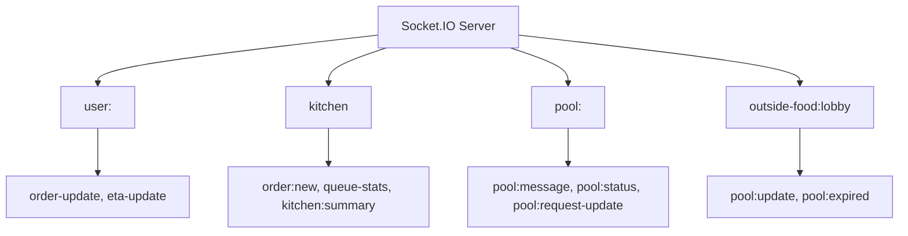

Realtime updates are used where delays would hurt the experience: kitchen orders, student order status, ETA changes, menu stock changes, queue summaries, and pool chat/state changes.

## Data Model Overview

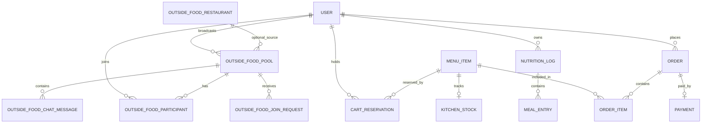

Important collections:

| Model | Purpose |
| --- | --- |
| User | Student, kitchen, and admin accounts with role, auth provider, contact data, and nutrition goals. |
| MenuItem | Canteen items, price, category, prep time, availability, nutrition, tags, and daily stock. |
| CartReservation | Temporary stock holds per user and menu item. |
| Order | Paid canteen order, user snapshot, items, status, ETA, QR token hashes, and completion history. |
| KitchenStock | Made quantity by menu item for allocation and pickup readiness. |
| NutritionLog | Daily meal entries and recalculated nutrition totals. |
| OutsideFoodPool | Student-created outside-food pool with broadcaster, amount target, status, participants, and coordinator data. |
| OutsideFoodParticipant | Member contribution, note, presence, and activity inside a pool. |
| OutsideFoodJoinRequest | Pending access requests for locked pools. |
| OutsideFoodChatMessage | Pool-room chat and broadcaster/system updates. |
| OutsideFoodRestaurant | Admin-managed restaurant data for the outside-food discovery flow. |
| Settings | Canteen and cart timing configuration. |

## API Surface

| Domain | Base Path | Main Responsibility |
| --- | --- | --- |
| Auth | `/api/auth` | OTP registration, login, Google sign-in, current user, profile updates. |
| Menu | `/api/menu` | Public menu reads plus kitchen/admin menu creation, editing, stock, nutrition analysis, and availability. |
| Cart | `/api/cart` | Temporary stock holds, hold release, and hold cleanup. |
| Payments | `/api/payments` | Razorpay order creation and signature verification. |
| Orders | `/api/orders` | Student orders, kitchen orders, QR, live queue, summary, stock production, and status updates. |
| Nutrition | `/api/nutrition` | Daily logs, weekly/monthly reports, goals, image analysis, meal logging, deletion, quantity edits. |
| Leaderboard | `/api/leaderboard` | Nutrition widget and full leaderboard data. |
| Admin | `/api/admin` | Users, analytics, canteen status, and cart hold settings. |
| Outside Food | `/api/outside-food` | Restaurants, pools, members, requests, pool status, archive, and chat. |
| Legacy Pools | `/api/pools` | Menu-item based pooled-order support. |

## Technology Stack

### Frontend

| Layer | Technology |
| --- | --- |
| App runtime | React 19 |
| Build tooling | Vite 6 |
| Styling | Tailwind CSS 4 plus custom CSS tokens and responsive component rules |
| Routing | React Router 7 |
| API client | Axios with JWT request interceptor |
| Realtime | Socket.IO Client |
| Charts | Recharts, lazy loaded where possible |
| Icons | React Icons and Lucide React |
| Forms and validation | React Hook Form and Zod where needed |
| Feedback | React Hot Toast |
| Performance | Route-level lazy loading, manual chunk splitting, memoized cards, cached menu data, incremental rendering |

### Backend

| Layer | Technology |
| --- | --- |
| Runtime | Node.js |
| API framework | Express |
| Database | MongoDB with Mongoose |
| Realtime | Socket.IO |
| Auth | JWT, bcrypt password hashing, Google OAuth support, OTP email registration |
| Payments | Razorpay |
| Image storage | Cloudinary through Multer storage |
| Email | Nodemailer-backed mail service |
| Queue logic | Custom queue, ETA, stock, cart hold, and allocation utilities |
| Analytics | MongoDB aggregation pipelines with short-lived in-memory caching |

## Performance and Reliability Choices

- Route-level lazy loading keeps inactive pages out of the first bundle.
- Menu cards avoid heavy image rendering in the student menu and rely on stable static icons.
- Menu data is cached in memory and session storage, then refreshed in the background.
- Student menu renders enough cards to fill the first viewport, then loads additional cards incrementally.
- Nutrition chart code is split out and loaded only when the details modal needs it.
- Admin analytics uses cache keys by date preset/range to reduce repeated expensive aggregation work.
- MongoDB indexes support frequent lookups for users, orders, QR tokens, menu filters, nutrition logs, pools, participants, and join requests.
- Cart reservations and daily stock reset jobs clean up time-sensitive state automatically.
- Outside-food pool sweep removes stale pool state and emits expiry updates.
- Payment-backed order creation is idempotent by user and Razorpay payment id to prevent duplicate orders.

## Security and Access Control

- Role-based route protection on the client for student, kitchen, and admin panels.
- Backend route authorization for kitchen/admin operations, user management, menu mutation, analytics, QR scanning, and restaurant administration.
- JWT authentication for API requests.
- Passwords are hashed with bcrypt before storage.
- OTP registration restricts self-registration and supports institution email rules.
- Razorpay signature verification protects payment completion.
- QR pickup tokens store hashes/lookups instead of raw secrets.
- Cloudinary uploads are limited to image formats and file-size constraints.

## Product Flow Summary

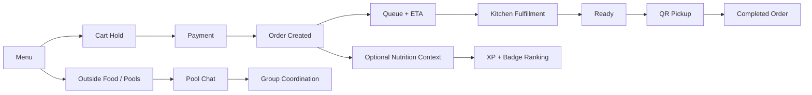

## Why UniFeast Matters

UniFeast is not only a menu page. It models the real operational loop of a campus canteen:

- Students need confidence that food is available before they pay.
- Kitchen staff need live visibility into what is waiting, what is ready, and what stock has been produced.
- Admins need truthful reporting tied to real student identity, spending behavior, and canteen usage.
- Nutrition tracking should connect to actual student eating behavior instead of being an isolated tracker.
- Group ordering outside the canteen needs structure: ownership, joining, approval, chat, and closure.

The result is one dining system where ordering, operations, analytics, nutrition, and community pooling all share the same user model and realtime backbone.

