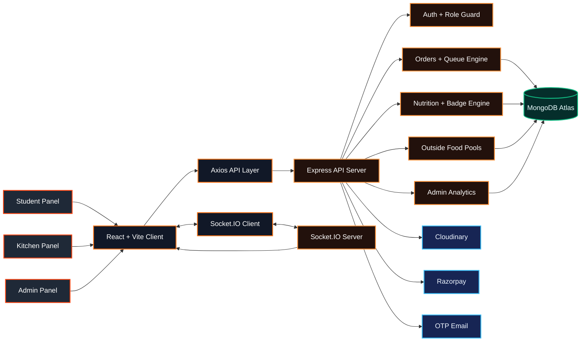
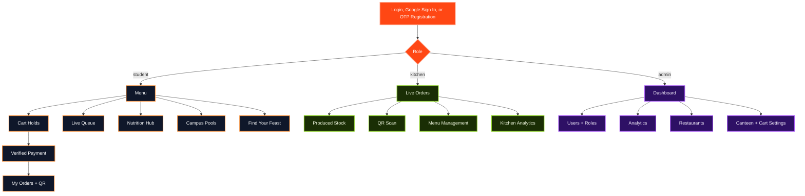
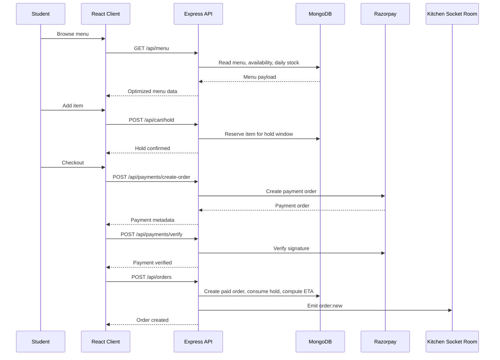
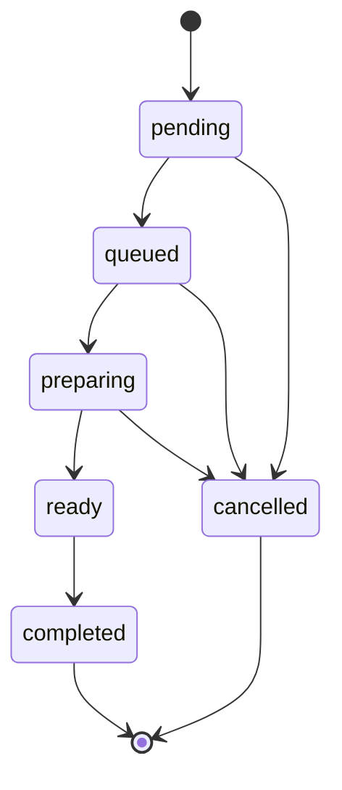
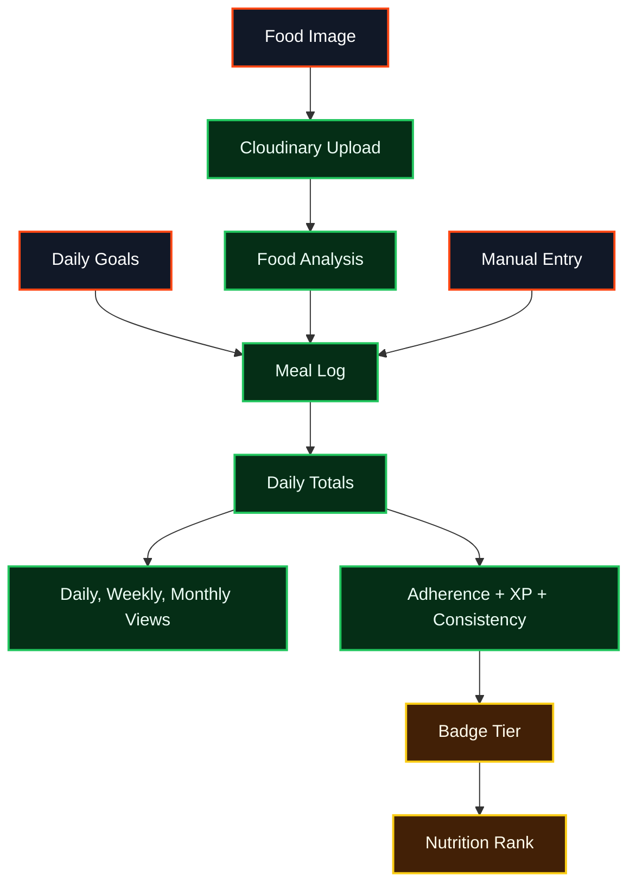
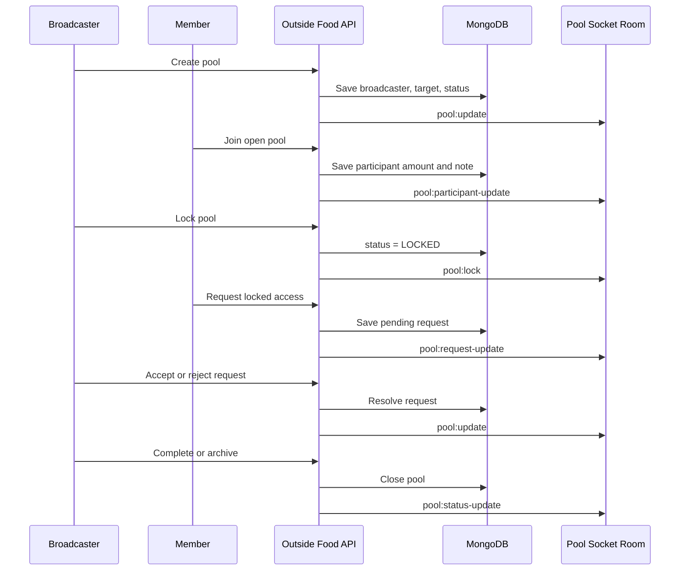
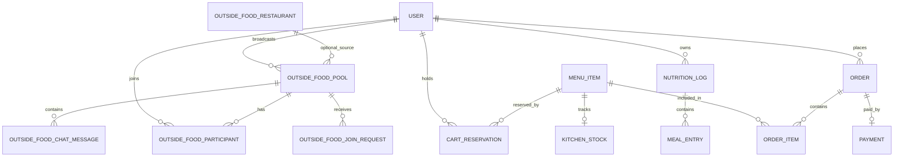
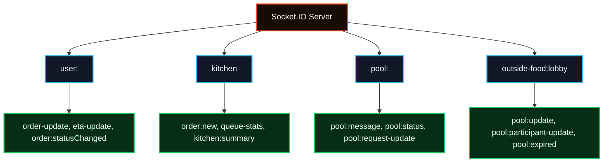
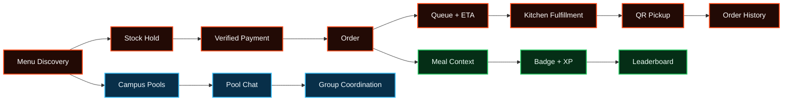

# UniFeast

### Campus Dining OS for IIIT Nagpur

  A private, full-stack dining platform connecting students, kitchen teams, admins, pooled orders, live queue visibility, nutrition intelligence, and analytics.

  
  
  
  
  

  
  
  
  
  

---

## Signal Board

| Zone | Flow | Signature Experience |
| --- | --- | --- |
| **Student** | Menu, cart holds, payment, QR pickup, live order tracking | Browse fast, reserve stock, pay safely, track without asking the counter. |
| **Kitchen** | Live orders, produced stock, queue timing, QR completion | Operational command center for preparation and pickup. |
| **Admin** | Users, roles, analytics, restaurants, canteen controls | A control room for usage, spend, students, items, and system settings. |
| **Nutrition** | Logs, goals, image analysis, charts, XP, badges | Food tracking tied to a competitive campus leaderboard. |
| **Pools** | Broadcaster-created pools, joining, requests, chat, closure | Group ordering with ownership, approval, and realtime coordination. |
| **Realtime Layer** | Orders, ETA, kitchen summary, stock, pools, chat | Socket.IO keeps every panel alive without manual refresh. |

## Visual Index

| Section | What It Shows |
| --- | --- |
| [System Map](#system-map) | How frontend, backend, sockets, database, payments, images, and mail connect. |
| [Role Portal](#role-portal) | Where each role lands and what they control. |
| [User Flow Gallery](#user-flow-gallery) | Ordering, kitchen fulfillment, nutrition ranking, and outside-food pooling. |
| [Feature Matrix](#feature-matrix) | The product surface by module. |
| [Data Constellation](#data-constellation) | Main MongoDB collections and relationships. |
| [Tech Stack](#tech-stack) | The exact technologies powering the product. |
| [Realtime Mesh](#realtime-mesh) | Event rooms and live updates. |

---

## System Map

## Role Portal

---

## User Flow Gallery

### 1. Student Canteen Order

### 2. Kitchen Fulfillment

```mermaid
flowchart LR
  Made[Produced Stock] --> Allocate[Auto Allocation]
  Allocate --> Waiting[Waiting Orders]
  Waiting --> Ready[Ready when all items assigned]
  Ready --> QR[Student QR]
  QR --> Scan[Kitchen Scan]
  Scan --> Complete[Completed Pickup]
  Complete --> Notify[Student + Kitchen Updates]

  classDef hot fill:#220a05,stroke:#ff4714,color:#fff,stroke-width:2px;
  classDef green fill:#052e16,stroke:#22c55e,color:#ecfdf5,stroke-width:2px;
  class Made,Allocate,Waiting hot;
  class Ready,QR,Scan,Complete,Notify green;
```

### 3. Nutrition Ranking

#### Nutrition Scoreboard

| Signal | Meaning | Weight or Rule |
| --- | --- | --- |
| Calories | Closeness to calorie goal | 35 percent |
| Protein | Progress toward protein target | 25 percent |
| Fiber | Progress toward fiber target | 15 percent |
| Carbs | Closeness to carb goal | 15 percent |
| Fat | Closeness to fat goal | 10 percent |
| Consistency | Valid day with meal data and 50 percent adherence | Counts toward badge days |
| XP | Logging and goal-hit activity points | Capped at 200 per day |

#### Badge Ladder

| Badge | Days | XP | Average Adherence |
| --- | ---: | ---: | ---: |
| Begin | 0 | 0 | 0 percent |
| Build | 14 | 1,000 | 60 percent |
| Balance | 28 | 2,500 | 65 percent |
| Steady | 50 | 5,000 | 70 percent |
| Aligned | 100 | 12,000 | 75 percent |
| Sustain | 200 | 28,000 | 80 percent |
| Thrive | 365 | 60,000 | 85 percent |

### 4. Outside Food Pooling

The creator is the broadcaster. The broadcaster sees **Created** in grey. Other members see **Joined** in green after they join.

---

## Feature Matrix

| Module | Student Surface | Kitchen/Admin Surface | Backend Brain |
| --- | --- | --- | --- |
| **Menu** | Search, categories, stock badges, nutrition preview | Create, edit, toggle, stock updates | `MenuItem`, upload middleware, stock reset jobs |
| **Cart** | Add, reduce, reserve item quantity | Cart hold duration control | `CartReservation`, cleanup worker |
| **Orders** | My Orders, active/completed states, QR pickup | Live board, item ready, status updates, QR scan | `Order`, queue service, ETA engine |
| **Payments** | Checkout with verified payment | Payment-backed order record | Razorpay order and signature verification |
| **Queue** | Live queue visibility | Kitchen summary and queue stats | Socket events and queue aggregation |
| **Nutrition** | Goals, logs, charts, analysis, ranks | Leaderboard visibility | `NutritionLog`, scoring engine, Cloudinary |
| **Pools** | Create, join, request, chat | Restaurant admin management | Pool service, participants, requests, chat messages |
| **Analytics** | Not exposed directly | Revenue, spend, cohorts, item sales | MongoDB aggregation and cache |

---

## Data Constellation

| Collection | Why It Exists |
| --- | --- |
| `User` | Identity, role, auth provider, nutrition goals, profile data. |
| `MenuItem` | Canteen catalog, price, category, prep time, availability, nutrition, daily stock. |
| `CartReservation` | Temporary stock holds before payment and order creation. |
| `Order` | Paid orders, item snapshots, ETA, QR token hashes, status history. |
| `KitchenStock` | Produced quantity available for allocation and readiness. |
| `NutritionLog` | Daily meal entries and recalculated macro totals. |
| `OutsideFoodPool` | Broadcaster-owned pools with status, target amount, participants, and closure state. |
| `OutsideFoodParticipant` | Joined members, contribution notes, presence, and activity. |
| `OutsideFoodJoinRequest` | Pending requests for locked pools. |
| `OutsideFoodChatMessage` | Pool-room chat, system messages, and broadcaster updates. |
| `OutsideFoodRestaurant` | Admin-managed discovery records for Find Your Feast. |
| `Settings` | Canteen live state and cart timing configuration. |

---

## Tech Stack

### Frontend Deck

| Layer | Stack |
| --- | --- |
| Core UI | **React 19**, component-driven pages, route-level lazy loading |
| Build | **Vite 6**, manual chunk splitting, fast production bundles |
| Routing | **React Router 7** with role-protected page trees |
| Styling | **Tailwind CSS 4**, custom CSS tokens, glass surfaces, dark/light theme variables |
| API | **Axios** with JWT request interceptor and 401 handling |
| Realtime | **Socket.IO Client** for order, queue, stock, and pool events |
| Charts | **Recharts**, lazy-loaded for nutrition visualizations |
| Forms | **React Hook Form**, **Zod**, controlled inputs where tighter state is needed |
| Icons | **React Icons**, **Lucide React** |
| Feedback | **React Hot Toast** |
| Performance | Memoized menu cards, cached menu data, incremental rendering, lazy modal chart code |

### Backend Core

| Layer | Stack |
| --- | --- |
| API | **Node.js**, **Express** |
| Database | **MongoDB Atlas**, **Mongoose** schemas and indexes |
| Auth | **JWT**, **bcryptjs**, Google OAuth, OTP email registration |
| Realtime | **Socket.IO** rooms for users, kitchen, pool rooms, and lobby updates |
| Payments | **Razorpay** order creation and signature verification |
| Images | **Multer**, **Cloudinary Storage**, Cloudinary transformations |
| Email | **Nodemailer** service for OTP delivery |
| Validation | **Zod** and explicit controller guards |
| Security | Role middleware, protected routes, hashed passwords, QR token hashing |
| Analytics | MongoDB aggregation pipelines with short-lived cache |

### Platform Services

| Service | Used For |
| --- | --- |
| MongoDB Atlas | Persistent application data |
| Cloudinary | Menu and nutrition image storage |
| Razorpay | Payment order creation and verification |
| Socket.IO | Realtime state propagation |
| Email SMTP | OTP delivery |

---

## Realtime Mesh

Realtime is used only where the product genuinely needs immediacy: kitchen operations, student order status, ETA changes, menu stock updates, queue summaries, and pool coordination.

---

## Reliability Notes

| Concern | UniFeast Handling |
| --- | --- |
| Overselling stock | Cart holds reserve stock before payment, then order creation consumes reservations. |
| Duplicate payment submissions | Order creation is idempotent by user and Razorpay payment id. |
| Pickup trust | QR payloads use lookup and secret values, with hashes stored server-side. |
| Expired state | Cart holds, daily stocks, and stale outside-food pools have cleanup jobs. |
| Analytics latency | Admin stats are cached briefly by selected date range. |
| Heavy frontend bundles | Route lazy loading, exact manual chunks, and lazy nutrition chart loading reduce first-load cost. |
| Future nutrition dates | Backend blocks future daily log reads. |

## Security Guardrails

| Layer | Protection |
| --- | --- |
| Identity | JWT sessions, bcrypt password hashing, Google OAuth support |
| Registration | OTP verification and institution email checks |
| Roles | Student, kitchen, and admin authorization on protected API routes |
| Payments | Razorpay signature verification before order creation |
| Uploads | Image-only Cloudinary upload pipeline with size limits |
| QR | Hashed token lookup and secret verification |
| Admin | User management, restaurants, analytics, and settings are role-restricted |

---

## Product Pulse

## Design Identity

UniFeast is designed like a compact operations console with a warm campus dining personality:

| Token | Product Feeling |
| --- | --- |
| Orange primary | Appetite, action, checkout, and high-priority operations. |
| Dark glass surfaces | Focused dashboard feel for repeated daily use. |
| Green live states | Canteen live, available stock, successful status, and ready signals. |
| Compact cards | Dense information without making students or staff scroll through noise. |
| Realtime badges | Clear state changes for orders, pools, queue, and availability. |

## Why UniFeast Matters

UniFeast is not just a menu screen. It models the real loop of campus dining:

- Students know what is available before they pay.
- Kitchen staff see what is waiting, what is ready, and what has been produced.
- Admins get reporting tied to real students, orders, BTID signals, and spending patterns.
- Nutrition tracking becomes part of the actual food journey instead of a disconnected tracker.
- Outside-food pooling gets ownership, joining, approval, chat, and closure.

The result is one connected dining system where ordering, operations, analytics, nutrition, and community pooling share the same identity layer and realtime backbone.

