# UniFeast

## 1. Snapshot
- **One-liner:** A role-based campus canteen platform with stock holds, verified payments, live kitchen ops, nutrition ranking, and outside-food pooling.
- **Who it is for:** Students, kitchen staff, and admins at IIIT Nagpur (institution-scoped emails).
- **What success looks like:** A student can reserve stock, pay once, track ETA live, pick up via QR; kitchen runs a live board; admins control users, stock settings, restaurants, and analytics.

## 2. Problem
### Pain
Campus canteens still run on walk-up ordering and verbal status checks. Students cannot see real availability, wait times, or whether an item will still exist by the time they reach the counter. Kitchen staff juggle handwritten or fragmented tickets with no shared queue model, so prep work and pickup handoff stay opaque.

Group ordering for delivery or shared restaurant runs is informal (chats, ad-hoc collections). There is no ownership, lock, approval, or shared room for coordinating who joined and how much they pledged. Nutrition tracking, when it exists, sits outside the actual meal path and rarely reflects what students ate on campus.

The operational gap is not “another menu app.” It is missing inventory reservation before pay, a enforceable kitchen state machine, realtime status, and campus-scoped identity so students, kitchen, and admin share one system of record.

### Who suffered
- **Students:** Uncertain stock, unknown wait, payment without pickup proof, fragmented group orders
- **Kitchen staff:** No live incoming board, weak item-ready allocation, manual completion checks
- **Admins:** Little visibility into spend, cohorts, item demand, or canteen/cart controls

### Constraints
- Campus-only identity: student emails constrained to `iiitn.ac.in`; kitchen/admin via allowlists
- Concurrent demand on limited daily stock during rush windows
- Must stay reliable across payment → order creation (network drops, duplicate submits)
- Realtime required for kitchen and pools without forcing page refresh
- Single Node process: in-memory lock/cache primitives instead of a dedicated Redis deployment
- Time-boxed team build (~6 weeks of active commits) across student/kitchen/admin surfaces

### Problem statement (1 sentence)
Build one authenticated campus dining system that reserves stock before payment, runs a live kitchen queue with ETAs and QR pickup, and coordinates outside-food pools—without inventing a second app for nutrition or group orders.

## 3. Solution
### Approach
UniFeast is a MERN app (React 19 + Vite 6 client, Express API, MongoDB/Mongoose) with Socket.IO as the realtime backbone. Auth is JWT plus optional Google sign-in and OTP email registration, with role guards (`student` | `kitchen` | `admin`) on both routes and APIs.

The canteen path is hold → pay → order → queue/ETA → kitchen fulfillment → QR pickup. Cart holds write `CartReservation` records that decrement daily stock for a configurable window; Razorpay creates and verifies payments; order creation is idempotent on `(user, razorpayPaymentId)`. The kitchen board advances orders through a validated state machine and can allocate produced stock per line item until the order is ready.

A separate outside-food module lets a broadcaster open a pool, accept joins/requests, chat in a pool room, lock, and close—synced over Socket.IO lobby/pool rooms. Nutrition is a first-class student hub: goals, meal logs (manual or image analysis via Hugging Face vision), adherence scoring, XP/badges, and leaderboards.

### Core features shipped
- **Menu + daily stock:** Browse/search/filter with availability and kitchen-managed stock so students order against real remaining quantity.
- **Cart stock holds:** Temporary reservations prevent overselling between “add” and paid order creation; expired holds release stock via cleanup jobs.
- **Razorpay checkout + idempotent orders:** Signature verification before success; duplicate payment IDs return the existing order instead of double-booking.
- **Pending-order recovery:** Client stores a short-lived local retry payload if order creation fails after payment success.
- **Queue + ETA engine:** Bucket/FCFS workload snapshot over active `queued`/`preparing` orders using menu batch capacity and prep times (`method: bucket-fcfs-snapshot`).
- **Kitchen live board:** Socket-driven incoming orders, status transitions, item-ready allocation from produced stock, QR scan completion.
- **QR pickup:** Lookup + secret token; secret stored as bcrypt hash server-side.
- **Outside-food pools:** Broadcaster ownership, join/request/lock/chat/close with lobby and per-pool rooms.
- **Nutrition hub:** Goals, logs, charts, image analysis, XP/badge ladder, campus leaderboard.
- **Admin control room:** Users/roles, analytics aggregations, restaurant catalog for Find Your Feast, canteen/cart settings.
- **Background maintenance:** Daily stock reset, cart reservation cleanup, canteen pool cleanup timer, outside-food pool TTL sweep.

## 4. Architecture
### Stack map

| Layer | Choice |
| --- | --- |
| Client | React 19, React Router 7, Axios, Socket.IO client, Tailwind 4, Recharts, RHF + Zod |
| API | Node.js, Express, Mongoose, Helmet/CORS, Multer |
| Data | MongoDB Atlas |
| Realtime | Socket.IO rooms (`user:<id>`, `kitchen`, `pool:<id>`, `outside-food:lobby`) |
| Payments | Razorpay order + HMAC signature verify |
| Media | Cloudinary (menu + nutrition images) |
| Auth | JWT Bearer, bcrypt passwords, Google OAuth, Nodemailer OTP |
| Nutrition vision | Hugging Face chat/completions (image + prompt → macros) |
| Concurrency | In-process `LockManager` (Map-based Redis stand-in) |

### System context

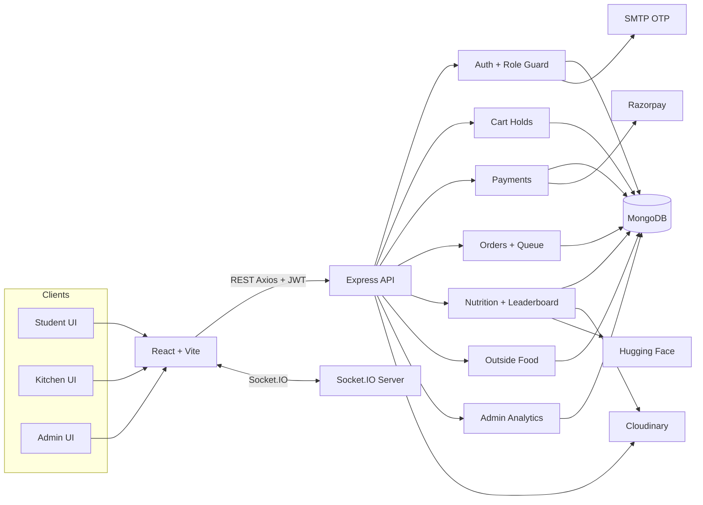

### Role portal

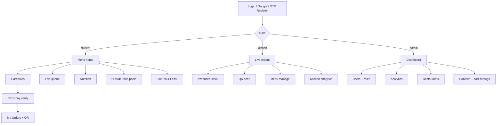

### Module layout (repo)

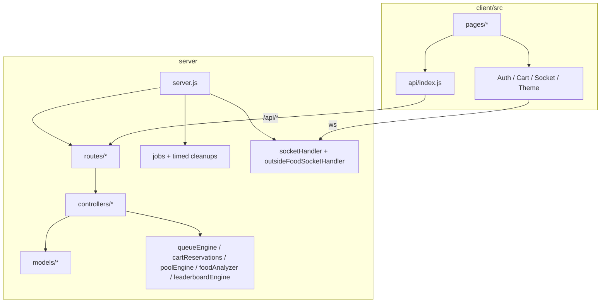

### Data constellation

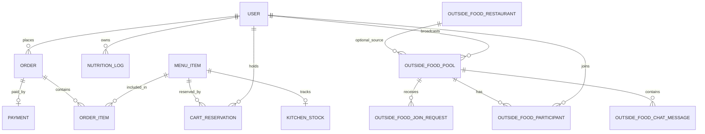

Primary collections: `User`, `MenuItem`, `CartReservation`, `Order`, `Payment`, `KitchenStock`, `NutritionLog`, `Settings`, `Pool` (canteen item pooling), `OutsideFoodPool`, `OutsideFoodParticipant`, `OutsideFoodJoinRequest`, `OutsideFoodChatMessage`, `OutsideFoodRestaurant`.

## 5. Key flows
### Student canteen order

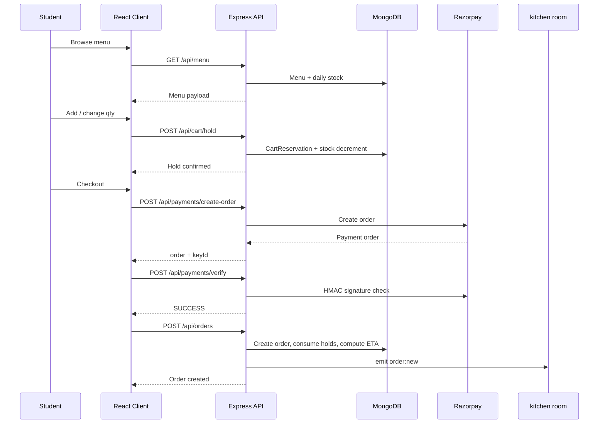

### Kitchen fulfillment + QR

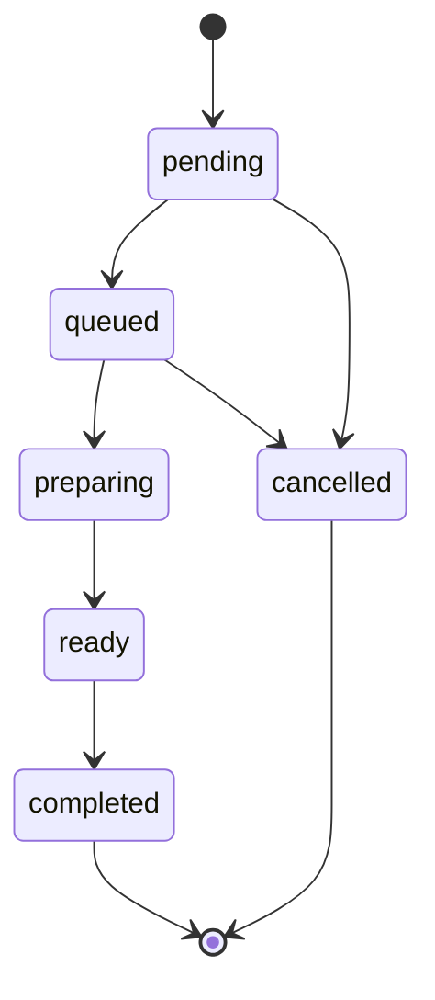

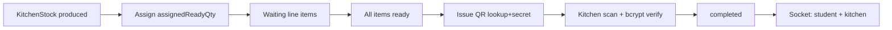

### Outside-food pool

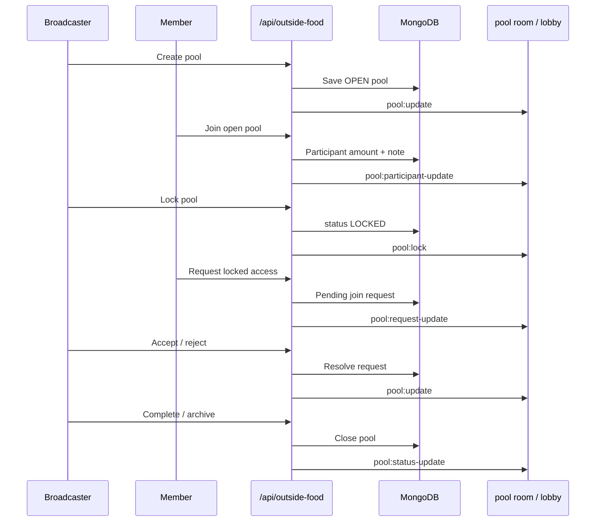

### Nutrition ranking

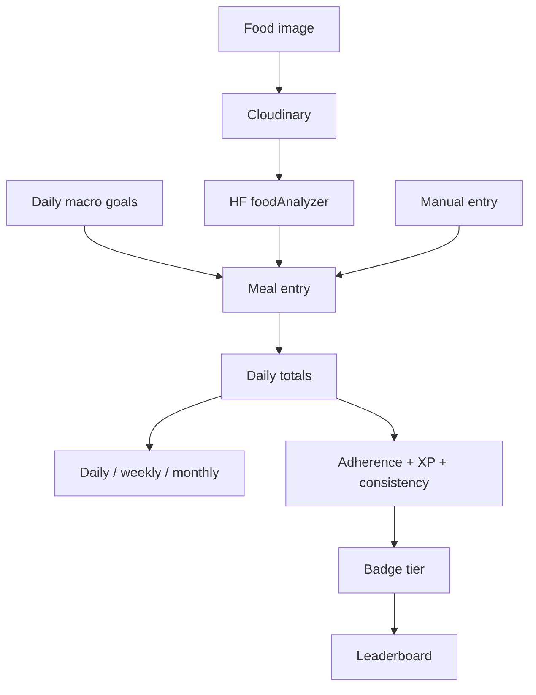

### Realtime mesh

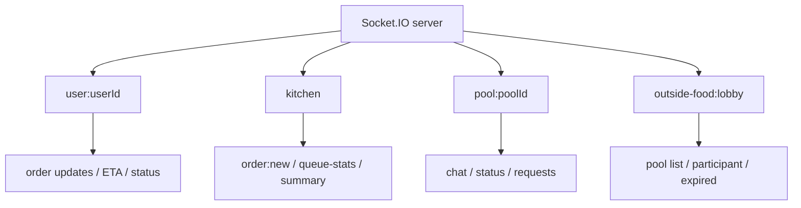

### Product loop (end-to-end)

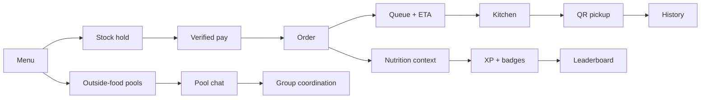

## 6. Challenges
### Concurrent stock without overselling
Multiple students can add the same limited item during rush. The system reserves quantity in `CartReservation`, ties it to a day key, and runs periodic release of expired holds so unpaid carts do not permanently drain stock. Order creation consumes reservations rather than trusting client-only cart state.

### Payment success / order failure gap
If the client verifies Razorpay but `POST /api/orders` fails, the student has paid without a kitchen ticket. Mitigation: unique index / lookup on `razorpayPaymentId`, idempotent create returning the existing order, and a client `localStorage` pending-order banner with retry (24h, same user).

### Kitchen state integrity
Orders must not jump states (e.g. `ready` → `queued`). `orderStateMachine` encodes allowed transitions; preparing→cancelled is admin-only with waste logging. Status updates can carry an idempotency key via the in-memory lock manager client to reduce duplicate kitchen taps.

### ETA that kitchen can actually feel
Early docs referenced Erlang-C / M/M/c. The shipped engine estimates remaining work from batch capacity, batch prep, buffers, and FCFS backlog across active queue orders (`bucket-fcfs-snapshot`), then recalculates when the queue changes. Accuracy depends on honest menu prep metadata and station assumptions (`KITCHEN_ACTIVE_STATIONS`).

### Realtime without a separate message bus
Kitchen boards, student order pages, stock badges, and pool lobbies all need push updates. Socket.IO rooms keep fan-out scoped; the API still owns writes so sockets broadcast facts already committed to MongoDB.

### Process-local locks vs distributed Redis
`LockManager` mimics Redis locks/KV/zsets in memory for pool join races and idempotency caches. This is correct for a single Node instance and wrong for multi-instance horizontal scale—an explicit deployment tradeoff visible in code comments.

### Campus-scoped trust
Registration and role checks enforce domain/allowlist rules so kitchen and admin surfaces are not open to arbitrary Google accounts. QR secrets are hashed; payment verification is server-side HMAC, not client trust.

### Bundle and ops weight
Route-level lazy loading and Vite manual chunks (React, charts, motion, socket) keep student first load lighter while still shipping Recharts nutrition views and a dense kitchen dashboard.

## 7. Outcomes
- **Shipped product:** Live deployment at the Vercel URL above; backend/API + Socket.IO paired with the React client.
- **Operational loop closed:** Hold → pay → order → kitchen board → QR complete is implemented end-to-end in controllers, models, and UI pages.
- **Multi-role surface:** Student, kitchen, and admin route trees with shared auth/socket providers.
- **Secondary loops:** Outside-food coordination and nutrition ranking share the same identity and realtime layer.
- **Reliability primitives:** Stock holds, payment idempotency, QR hashing, timed cleanups for carts/stock/pools.
- **Measured product metrics in-repo:** Unknown (no production analytics dump or user-count docs in the repository).

## 8. Tech stack
- **Frontend:** React 19, Vite 6, React Router 7, Tailwind CSS 4, Axios, Socket.IO Client, Framer Motion, Recharts, React Hook Form, Zod, Zustand (available), jsQR / qrcode
- **Backend:** Node.js, Express 4, Mongoose 8, Socket.IO 4, JWT, bcryptjs, Zod, Multer, express-rate-limit, Helmet
- **Integrations:** MongoDB Atlas, Razorpay, Cloudinary, Nodemailer, Google Auth Library, Hugging Face Router API
- **Jobs / engines:** `queueEngine`, `cartReservations`, `dailyStock`, `poolEngine`, `outsideFoodPoolSweep`, `leaderboardEngine`, `foodAnalyzer`
- **Not shipped as dependency:** Dedicated Redis (in-memory stand-in only); `zombieOrderSweep.js` exists but is not wired into `server.js` and is not listed as a dependency

## 9. Links
- **Live:** https://unifeast-five.vercel.app
- **Repo:** https://github.com/dipeshkr04/UniFeast
- **Cover / screenshots:** N/A — set manually in portfolio UI
