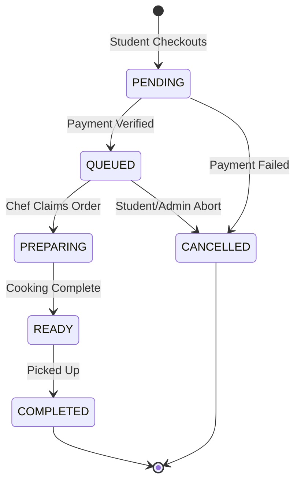
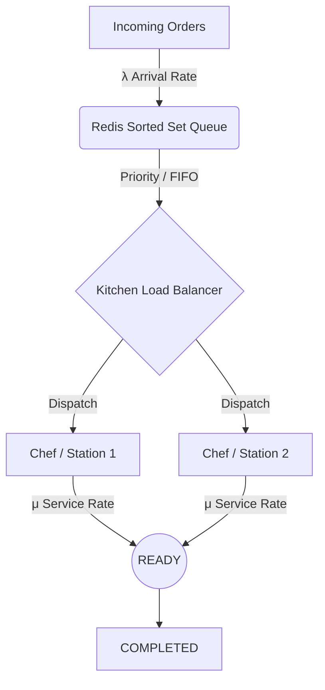

# Kitchen Order Workflow System: Technical Architecture & Mathematical Model

## 1. Define the System as a State Machine

The kitchen order workflow is a strict Directed Acyclic Graph (DAG) for forward progress, with specific abort paths.

### 1.1 State Definitions
* **`PENDING`**: Payment initiated, pool open, but order not yet finalized/committed to kitchen.
* **`QUEUED`**: Order finalized, payment secured. Logged in the system awaiting kitchen capacity.
* **`PREPARING`**: Assigned to a prep station/chef. Ingredients are being utilized.
* **`READY`**: Cooking complete. Waiting for student pickup/delivery.
* **`COMPLETED`**: Handed off to the student. Terminal state.
* **`CANCELLED`**: Aborted. Can only happen before `PREPARING`.

### 1.2 Valid & Invalid Transitions
**Valid Transitions:**
* `PENDING` → `QUEUED` (Checkout success / Pool closes)
* `PENDING` → `CANCELLED` (Payment failed / timeout)
* `QUEUED` → `PREPARING` (Chef capacity frees up)
* `QUEUED` → `CANCELLED` (Admin/Student cancels before prep)
* `PREPARING` → `READY` (Chef marks food as cooked)
* `READY` → `COMPLETED` (Student picks up food)

**Invalid Transitions (Must be strictly prevented):**
* `PREPARING` → `CANCELLED`: Food is already cooking, resources consumed. (Requires manual admin overwrite and inventory reconciliation).
* `QUEUED` → `READY`: Skips preparation constraints and ETA calculations.
* `COMPLETED` → *Any*: Terminal state immutability.

---

## 2. End-to-End Order Lifecycle

1. **Placement (`PENDING`)**: Student adds item to cart. If joining a pool, lock is acquired. Once timer expires or checkout completes, move to `QUEUED`.
2. **Ingestion (`QUEUED`)**: Order enters the global FIFO/Priority queue (e.g., Redis Sorted Set). ETA is calculated via Erlang-C and broadcast via Socket.io.
3. **Dispatch (`PREPARING`)**: A Chef node broadcasts availability. The Queue Engine pops the highest priority order. Status updates in DB. Socket emits `status_preparing`.
4. **Cooking (`PREPARING` progress)**: Time elapses (T_prep).
5. **Quality/Completion (`READY`)**: Chef hits "Done." Socket emits `status_ready` to student's app.
6. **Handoff (`COMPLETED`)**: Student presents ID/Order #. Kitchen hits "Delivered." Analytics and `NutritionLog` are updated.

---

## 3. Mathematical Modeling of Flow

The system runs on the M/M/c queueing model (Erlang-C) to dynamically predict ETAs.

### 3.1 Variables
* $O$ = Number of active orders
* $c$ = Number of parallel kitchen stations / chefs
* $T_{prep}$ = Average preparation time per order (service time, exponential distribution)
* $\lambda$ (Lambda) = Order arrival rate (orders per minute)
* $\mu$ (Mu) = Service rate per chef ($1 / T_{prep}$)
* $\rho$ (Rho) = System utilization factor = $\frac{\lambda}{c \cdot \mu}$

### 3.2 Constraints & Stability
For the queue to remain stable and not grow infinitely: 
$$\rho < 1 \implies \lambda < c \cdot \mu$$

### 3.3 Delay & ETA Formulas (Erlang-C)
**Probability of waiting in queue ($P_W$):**
$$P_W = \frac{ \frac{(c \rho)^c}{c! (1 - \rho)} }{ \sum_{k=0}^{c-1} \frac{(c \rho)^k}{k!} + \frac{(c \rho)^c}{c! (1 - \rho)} }$$

**Expected Waiting Time in Queue ($W_q$):**
$$W_q = \frac{P_W \cdot T_{prep}}{c \cdot (1 - \rho)}$$

**Total Time in System ($T_{sys}$ / Base ETA):**
$$ETA = W_q + T_{prep}$$

**Throughput Capability:**
*Max Throughput* = $c \cdot \mu = \frac{c}{T_{prep}}$

---

## 4. Transition Logic (Backend Rules)

### 4.1 PENDING → QUEUED
* **Trigger:** Payment Gateway Webhook / Pool Countdown reaches 0.
* **Validation:** Verify payment integrity. Ensure items are in stock using a Redis Distributed Lock on inventory limits.

### 4.2 QUEUED → PREPARING
* **Trigger:** Kitchen Dashboard API call `PUT /api/orders/:id/status`.
* **Condition:** Current active items in `PREPARING` must be strictly `< c` (Chef capacity). 
* **Action:** Update status, emit socket event, capture `startedAt` timestamp.

### 4.3 PREPARING → READY
* **Trigger:** Chef button press.
* **Validation:** Order must currently be in `PREPARING` state.
* **Action:** Stamp `preparedAt` timestamp. Recalculate global queue expected times (since $T_{prep}$ actuals feed back into the $\mu$ average).

---

## 5. Edge Case Handling (VERY IMPORTANT)

1. **System Overload (Queue Overflow / $\rho \ge 1$):**
   * *Trigger:* Sudden surge of students post-lecture.
   * *Handling:* Dynamic surge pricing or temporary ordering pause for specific items. The ETA engine will natively reflect huge wait times, acting as a natural deterrent.
2. **Race Conditions (Multiple Chefs claim same order):**
   * *Handling:* Optimistic Concurrency Control (OCC) using MongoDB document `__v` versioning, OR Redis `SETNX` (Set if Not eXists) when moving from `QUEUED` to `PREPARING`. 
3. **No Chef Available:**
   * *Handling:* Order remains `QUEUED`. $W_q$ linearly increases. Socket.io pushes delayed ETAs to clients.
4. **Order Cancellation at `PREPARING`:**
   * *Handling:* UI hides standard cancel button. Only Kitchen Admin can override. Requires inventory waste logging logic.
5. **Node Crash Mid-Prep:**
   * *Handling:* "Zombie" orders. A Cron job sweeps `PREPARING` orders older than `Max_T_prep * 3`. Pushes alert to Kitchen Admin dashboard to verify if food was lost or just forgot to click "Ready".

---

## 6. Concurrency & Synchronization

* **Distributed Locking (Redis/Redlock):** Crucial when aggregating a "Pool" of identical orders into one large batch. Ensure two nodes don't simultaneously close the pool and create duplicate kitchen chits.
* **Idempotent APIs:** Kitchen tablet might double-tap "Move to Preparing" due to bad WiFi. The payload must include an `idempotency_key` or strictly check `requires state == QUEUED`. The second request must return `200 OK` (no-op) or `409 Conflict`, NOT crash or duplicate.
* **Atomic Updates:** MongoDB `$set` combined with conditional matching: `Order.updateOne({ _id: id, status: 'QUEUED' }, { $set: { status: 'PREPARING' } })` ensures state corruption cannot occur.

---

## 7. Optimization Strategies

1. **The Pooling Engine (Batching):** Instead of individual orders, group 5 "Burger" orders arriving within 2 minutes into 1 "Pool". This modifies the service rate ($\mu$). Making 5 burgers at once does not take $5 \cdot T_{prep}$, it takes $T_{prep} \cdot 1.5$. This dramatically lowers $\rho$ and increases throughput.
2. **Priority Queueing:** Paid expedites, or pre-scheduled bulk orders bypass the standard FIFO, moving into a High-Priority `QUEUED` lane.
3. **Dynamic $c$ Allocation:** As ML (Clarifai data/historical logs) realizes the grill is overloaded, it suggests shifting flexible staff ($c$) from prep to grill, locally adjusting the Erlang-C variables line-by-line.

---

## 8. Data Structures & Backend Design

**Data Structures:**
* **Active Queue:** Redis Sorted Set (`ZADD kitchen:queue <timestamp/priority> <order_id>`). Allows $O(log N)$ extraction.
* **Order Tracking:** Redis Hash (`HSET order:state...`) for lightning-fast socket retrievals, backed by MongoDB for persistent storage (`Models/Order.js`).

**API Flow:**
1. `POST /api/orders` -> Validates, creates DB entry (`PENDING`), creates checkout session.
2. webhook `POST /api/payments/complete` -> Modifies DB (`QUEUED`), adds to Redis Sorted Set. Emits `queue_updated`.
3. `PATCH /api/orders/:id/status` -> Kitchen client takes action. Validates OCC. Removes from Redis queue if `PREPARING`. Emits `status_changed`.

---

## 9. Visualization

### 9.1 State Transition DAG

### 9.2 Queue Processing Model
