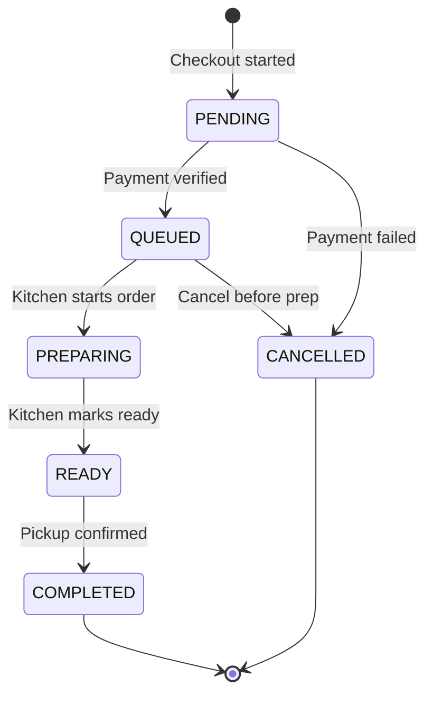
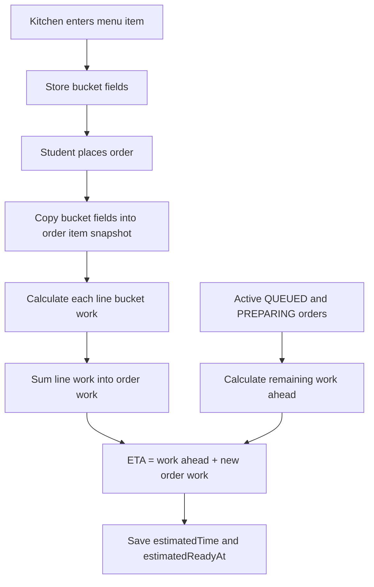
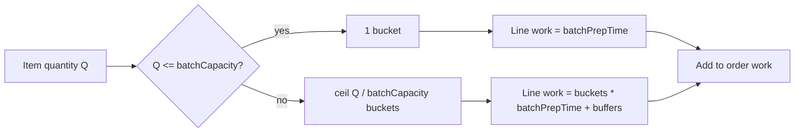
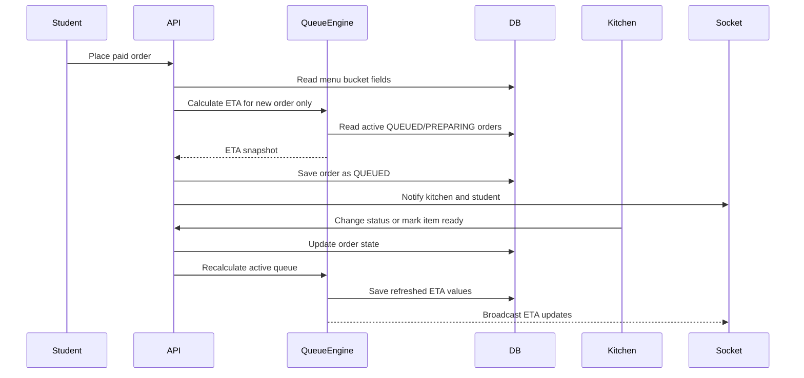
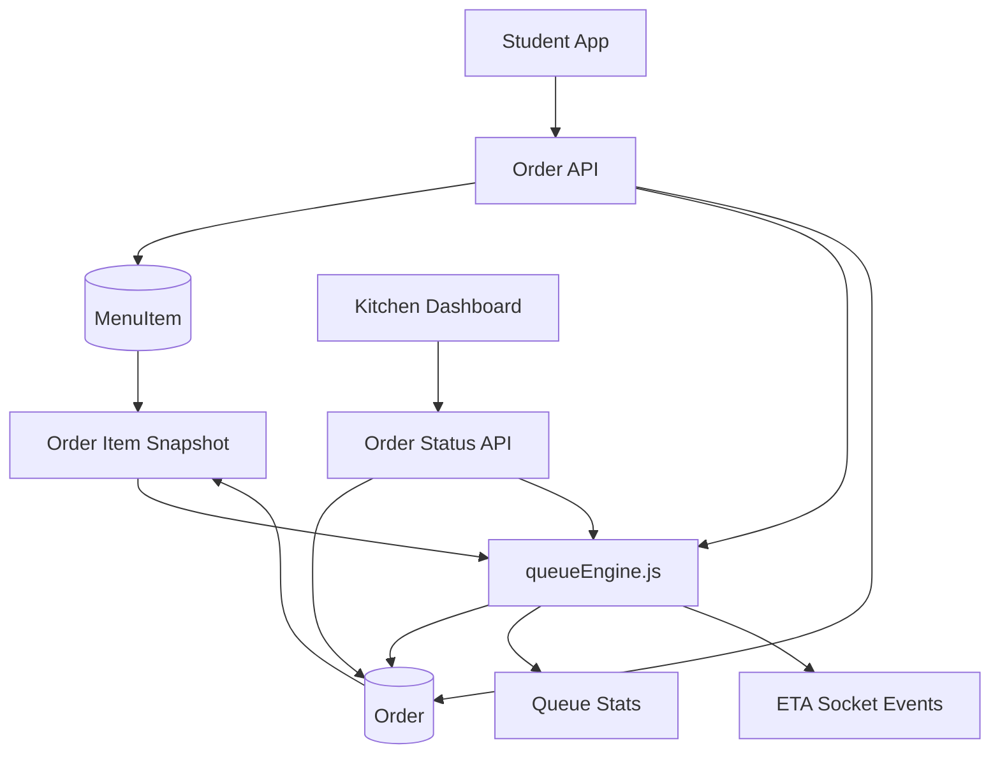

# UniFeast Kitchen Queue Logic

This document is the final kitchen queue model used by the backend.

The system intentionally keeps ETA calculation simple, explainable, and controlled by only three kitchen-entered variables per menu item.

In the UI these are shown as Bucket capacity, Bucket prep, and Bucket buffer. In the database/API they are stored as:

1. `batchCapacity`
2. `batchPrepTime`
3. `batchBufferMinutes`

No ML timing model, no hidden item profiles, and no Erlang-C ETA math are used for the student-facing queue time. The novelty is practical kitchen batching: the system understands that some quantities can be prepared together instead of multiplying prep time item-by-item.

---

## 1. Order State Machine

### States

| State | Meaning |
|---|---|
| `PENDING` | Payment/order creation started but not finalized for kitchen. |
| `QUEUED` | Paid order is accepted and waiting in kitchen queue. |
| `PREPARING` | Kitchen has started preparing the order. |
| `READY` | Food is ready for pickup. |
| `COMPLETED` | Student has collected the order. Terminal state. |
| `CANCELLED` | Order cancelled before preparation, except admin override cases. |

### Valid Transitions



Invalid transitions are blocked by backend validation:

| Invalid Transition | Reason |
|---|---|
| `PREPARING` to `CANCELLED` | Food/resources may already be used. |
| `QUEUED` to `READY` | Skips actual prep start. |
| `COMPLETED` to any state | Completed orders are immutable. |

---

## 2. Kitchen Variables

Every menu item stores the normal item metadata plus three queue variables.

| DB Field | UI Label | Symbol | Meaning | Example |
|---|---|---:|---|---|
| `batchCapacity` | Bucket capacity | `B_i` | Maximum quantity that can be prepared together in one batch. | 10 cold coffees at once |
| `batchPrepTime` | Bucket prep | `F_i` | Time to prepare one full or partial bucket. | 5 minutes |
| `batchBufferMinutes` | Bucket buffer | `G_i` | Extra reset/plating/setup time between buckets. | 1 minute |

Fallback behavior:

| Missing Field | Fallback |
|---|---|
| `batchCapacity` | `1` |
| `batchPrepTime` | item `prepTime` |
| `batchBufferMinutes` | `0` |

This keeps old or simple items working as classic one-by-one prep.

---

## 3. Core Formula

For a single order line:

| Variable | Meaning |
|---|---|
| `Q_i` | Remaining quantity for this item line |
| `B_i` | Bucket capacity |
| `F_i` | Bucket prep time |
| `G_i` | Bucket buffer time |

### Bucket Count

```math
Buckets_i = ceil(Q_i / B_i)
```

### Line Work

```math
LineWork_i = (Buckets_i * F_i) + ((Buckets_i - 1) * G_i)
```

### Order Work

```math
OrderWork = sum(LineWork_i)
```

The order still uses simple addition like the original arithmetic model. The only change is that each item line is bucketized before addition.

---

## 4. ETA Formula

Only active orders affect queue workload:

```text
ACTIVE = QUEUED + PREPARING
```

For a new incoming order:

```math
WorkAhead = sum(RemainingWork of active orders created before this order)
```

```math
ETA_new = ceil(WorkAhead + OrderWork_new)
```

For a `PREPARING` order:

```math
RemainingWork = max(0.5, OrderWork - elapsedPrepMinutes)
```

For a `QUEUED` order:

```math
RemainingWork = OrderWork
```

Important behavior:

- New orders do not change already promised ETAs immediately.
- Existing ETAs are recalculated only when kitchen state changes, such as `PREPARING`, item ready, `READY`, `COMPLETED`, `CANCELLED`, or produced stock updates.
- This preserves the student promise while still correcting the queue when real kitchen progress happens.

---

## 5. Example Calculations

### Cold Coffee

| Variable | Value |
|---|---:|
| `batchCapacity` | `10` |
| `batchPrepTime` | `5` |
| `batchBufferMinutes` | `1` |

| Quantity | Buckets | Work |
|---:|---:|---:|
| 1 | 1 | 5 min |
| 10 | 1 | 5 min |
| 11 | 2 | 11 min |
| 20 | 2 | 11 min |
| 21 | 3 | 17 min |

### Idli

| Variable | Value |
|---|---:|
| `batchCapacity` | `4` |
| `batchPrepTime` | `6` |
| `batchBufferMinutes` | `1` |

| Quantity | Buckets | Work |
|---:|---:|---:|
| 1 | 1 | 6 min |
| 4 | 1 | 6 min |
| 5 | 2 | 13 min |
| 8 | 2 | 13 min |

---

## 6. Backend Data Contract

### Menu Item

The kitchen/admin enters:

```text
name
price
prepTime
batchCapacity
batchPrepTime
batchBufferMinutes
maxOrder
isAvailable
nutrition
dailyStock
```

### Order Item Snapshot

When an order is created, the backend copies the current kitchen timing values into the order item:

```text
menuItem
name
price
imageUrl
category
quantity
assignedReadyQty
batchCapacity
batchPrepTime
batchBufferMinutes
```

This snapshot matters because later menu edits should not rewrite the promise for an already placed order.

---

## 7. Queue Calculation Flow



---

## 8. Bucket Arithmetic Diagram



---

## 9. Queue Recalculation Flow



---

## 10. Module Dependency Map



---

## 11. Why This Is Novel

The normal simple queue model says:

```text
quantity * prepTime
```

That fails for canteens because many items are naturally prepared together.

The UniFeast model says:

```text
ceil(quantity / batchCapacity) * batchPrepTime + buffer between buckets
```

This is still transparent arithmetic, but it models real kitchen batching:

- 1 cold coffee and 10 cold coffees can take the same bucket prep time.
- 1 idli serving and 4 idli servings can share the same steaming batch.
- Large orders increase ETA only when they cross the next bucket threshold.
- Kitchen staff can tune the system from the menu form without code changes.

---

## 12. Final Backend Rule

Student-facing ETA must come only from:

```text
batchCapacity
batchPrepTime
batchBufferMinutes
active order remaining quantities
createdAt order sequence
preparing elapsed time
```

It must not depend on hidden hard-coded item profiles, learned timing tables, or Erlang-C queue formulas.
